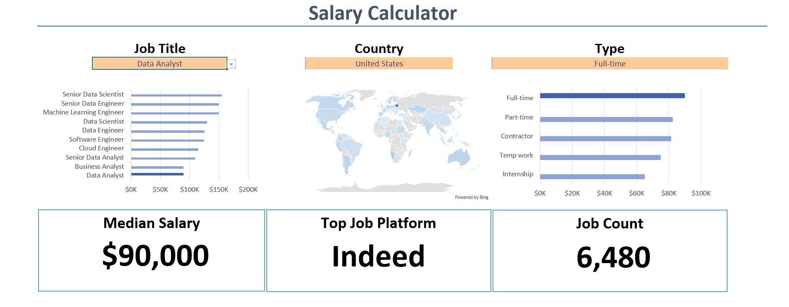

# Excel Salary Dashboard

An Excel-based salary analysis project built using **32,000+ job listings** to explore salary trends, job demand, and job-search patterns across different roles, countries, and job types.

The goal of this project was to turn a large, raw dataset into an interactive dashboard that makes it easier to answer practical questions about the job market.

## Dashboard Preview

## Project Overview

This project analyzes job listings based on:

* Job title
* Country
* Job type
* Salary
* Job application platform

The dashboard allows users to filter the data and quickly understand how salary levels and job availability change across different job-market segments.

## Key Insights

The dashboard provides:

* **Median Salary** — Understand the typical salary while reducing the effect of unusually high or low salaries.
* **Job Count** — Track the number of available jobs based on selected filters.
* **Top Job Application Platform** — Identify which platform has the highest number of job listings.
* **Job Title Analysis** — Compare demand across different roles.
* **Country Analysis** — Explore job availability across countries.
* **Job Type Analysis** — Compare different types of employment opportunities.

## Dashboard Features

The dashboard is interactive, allowing users to select different:

* Job titles
* Countries
* Job types

The displayed KPIs and charts update based on the selected filters, making it possible to explore different combinations of the dataset without manually analyzing individual rows.

## Dataset

* **Records:** 32,000+
* **Tool:** Microsoft Excel
* **Data type:** Job listings
* **Main fields:** Job title, country, job type, salary, application platform

## What I Worked On

This project helped me practice the complete process of taking a raw dataset and turning it into a usable analytical dashboard.

### Data Preparation

* Worked with 32,000+ rows of job listing data
* Cleaned and organized the dataset
* Prepared fields for analysis and dashboard use

### Data Analysis

* Calculated median salary
* Analyzed job counts across different dimensions
* Identified the most frequently used job application platform
* Compared job availability by title, country, and job type

### Dashboard Development

* Created an interactive Excel dashboard
* Added filters for easier exploration
* Designed KPI cards and visualizations
* Structured the dashboard so users can quickly identify important patterns

## Tools Used

**Microsoft Excel**

Key Excel concepts used:

* Data cleaning
* Sorting & filtering
* Pivot Tables
* Pivot Charts
* Formulas
* KPI calculations
* Interactive dashboard design
  
## Project Takeaways

This was my first mini-project focused on applying Excel to a real-world dataset rather than working with small practice tables.

The project gave me hands-on experience with handling a relatively large dataset, performing exploratory analysis, and presenting the results in a dashboard that can be interacted with by the user.

## Future Improvements

Some areas I would explore in a future version:

* Add more salary-based analysis
* Analyze salary differences between countries and roles
* Add additional job-market KPIs
* Recreate the analysis using SQL and Power BI
* Automate more of the data-cleaning process

## Author

**Praful Gupta**

